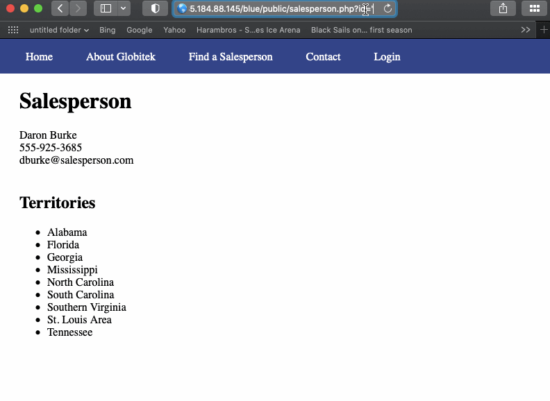
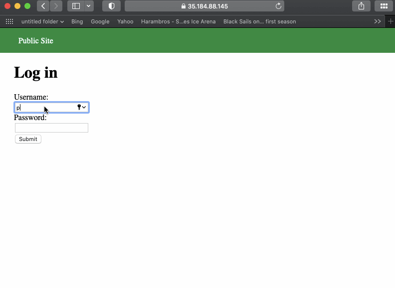
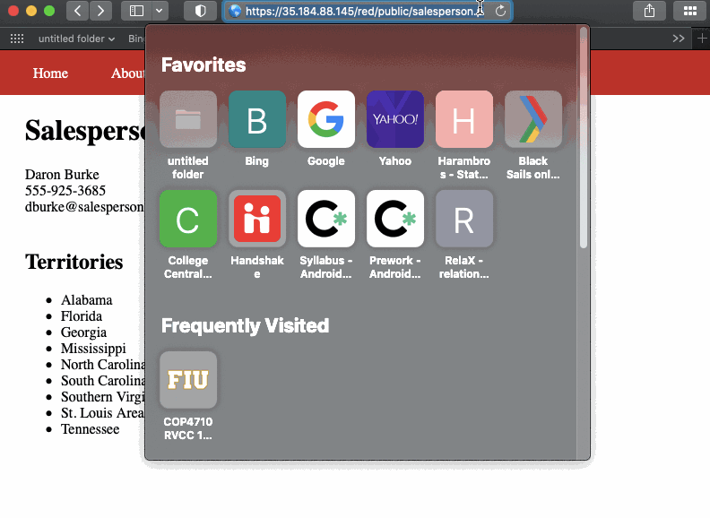

# Project 9 - Pentesting Live Targets

Time spent: **2** hours spent in total

> Objective: Identify vulnerabilities in three different versions of the Globitek website: blue, green, and red.

The six possible exploits are:

* Username Enumeration
* Insecure Direct Object Reference (IDOR)
* SQL Injection (SQLi)
* Cross-Site Scripting (XSS)
* Cross-Site Request Forgery (CSRF)
* Session Hijacking/Fixation

Each color is vulnerable to only 2 of the 6 possible exploits. First discover which color has the specific vulnerability, then write a short description of how to exploit it, and finally demonstrate it using screenshots compiled into a GIF.

## Blue

Vulnerability #1: SQL Injection (SQLi)

Description: I was able to pu the database to sleep by using the following query ' or SLEEP(10)=0 --'

## Green

Vulnerability #1: Username Enumeration

Description: I logged in with a real username and an incorrect password and I found that the description of "Log in was unsaccessful" was in bold; however, when I did it with a non exiting username I found the same description was not in bold.

## Red

Vulnerability #1:  Insecure Direct Object Reference (IDOR)

Description: I tried different ID= and I found that after the number 10 (ID=10) I got some people in the list that shouldn't been there because they got fired, for example. 

